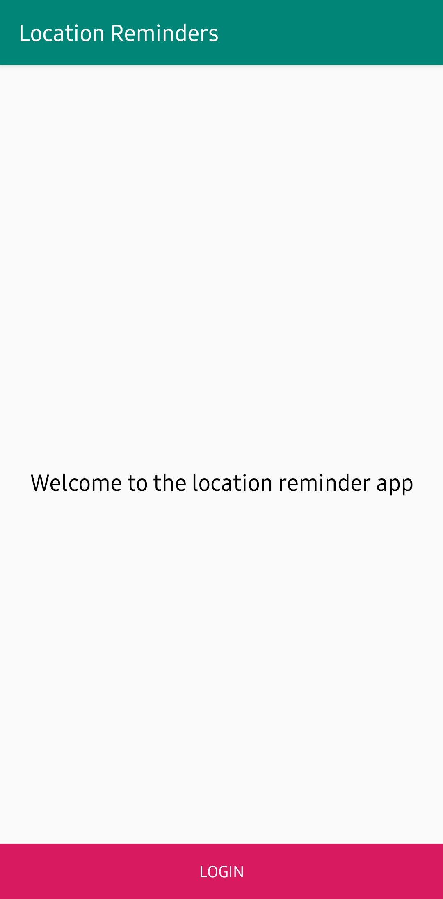
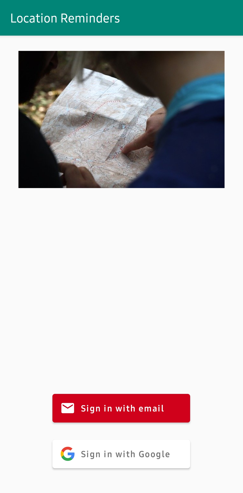
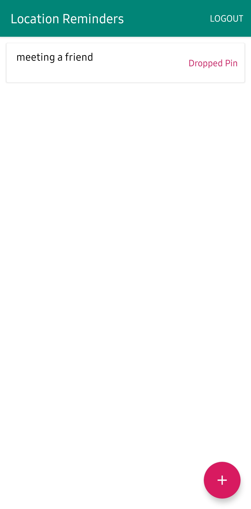
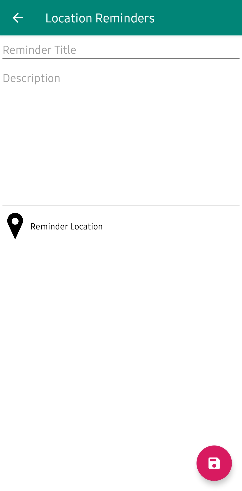
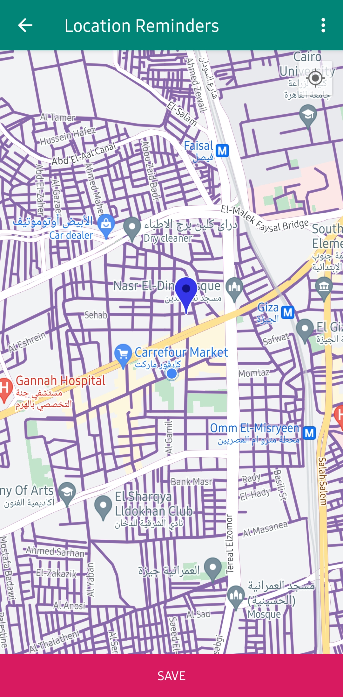
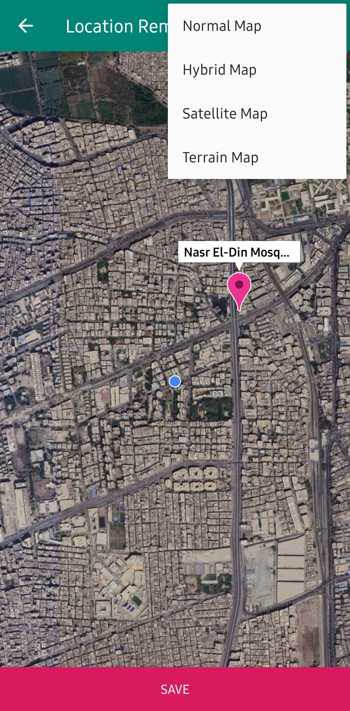
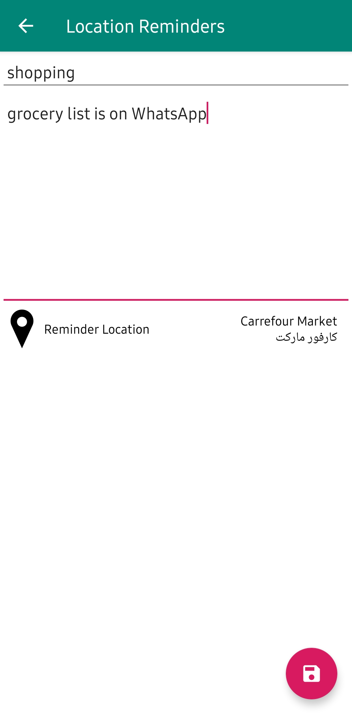
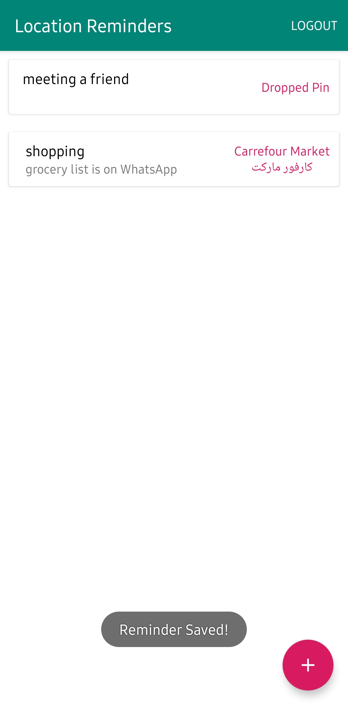

# LocationReminders
A TODO list app with location reminders that remind the user to do something when the user is at a specific location. The app will require the user to create an account and login to set and access reminders. Part of the Advanced Android Kotlin Development nanodegree from Udacity.

|Welcome|Login|Home|Create Reminder|
|:---:|:---:|:---:|:---:|
|||||

|Select Location|Map View|Save Reminder|Reminder Saved|
|:---:|:---:|:---:|:---:|
|||||

_[Directions to get a Google Maps API key](https://developers.google.com/maps/documentation/android-sdk/get-api-key)_
 
_You can add your API key in [google_maps_api.xml string resource](app/src/debug/res/values/google_maps_api.xml)_

The app lets the user save a reminder by entering a title, optional description, and a location via Google map.
Permission is asked initially for the current location and the when current location icon is tapped, but not mandatory.
Constant location access is then asked for geofencing by opening device settings and notifying the user when proceeding without the permission.

Topics:
- Google Maps API
- FirebaseUI
- Permissions
- Repository Pattern
- Notifications
- Testing
- UI Testing
- Geofence
